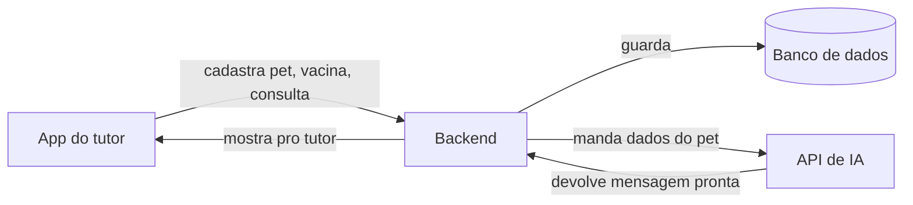

# Componente de Inteligência Artificial - CLYVO VET

Sprint 3 - Disruptive Architectures: IoT, IoB & Generative IA

## Qual problema a IA resolve

Hoje o tutor esquece vacina, esquece retorno, não sabe direito o que fazer com o pet em cada fase da vida. A IA entra pra resolver isso: ler os dados do pet (espécie, idade, histórico) e gerar uma mensagem personalizada de cuidado, em vez de um lembrete genérico igual pra todo mundo.

Exemplo de como ficaria: em vez de mandar "vacina pendente" pra todo mundo igual, a IA gera algo tipo "Rex, cachorro de 2 anos, está com a vacina antirrábica vencendo em 5 dias. Agende o reforço com a clínica."

## Abordagem escolhida: IA Generativa via API

A gente decidiu usar um LLM (modelo de linguagem, tipo o ChatGPT) acessado por uma API pronta, como a da OpenAI ou a do Google Gemini. Não tem treinamento de modelo do zero, é só usar um modelo que já existe e mandar os dados do pet pra ele gerar a mensagem.

Por que essa e não outra abordagem: é a mais viável pra um projeto de faculdade, porque não precisa de uma base de dados gigante nem de treinar nada, e é a que mais faz sentido com o nome da disciplina, que já fala em Generative IA. Além disso é fácil de mostrar no vídeo: dá pra mostrar o dado do pet entrando e a mensagem saindo pronta.

Como funciona na prática:

1. O sistema pega os dados do pet que estão salvos (espécie, idade, histórico de vacina e consulta).
2. Monta uma pergunta com esses dados, tipo "gera uma mensagem curta lembrando o tutor desse pet sobre essa pendência".
3. Manda essa pergunta pra API do LLM.
4. O LLM devolve o texto pronto.
5. O app mostra essa mensagem pro tutor.

O mesmo mecanismo dá pra usar num assistente dentro do app: o tutor pergunta alguma coisa, o sistema manda a pergunta junto com os dados do pet pro LLM, e ele responde.

## Dados que a IA usa

Espécie, raça e idade do pet, vindos do cadastro que o tutor faz no app - serve pra personalizar a mensagem, já que um filhote e um pet idoso precisam de cuidados diferentes.

Histórico de vacinas, registrado no app - serve pra saber o que está pendente ou vencendo.

Consultas e medicamentos, registrados pelo tutor ou pelo veterinário - dão contexto pra mensagem e pra um possível resumo do histórico.

Check-ins e atividade do tutor no app (parte de gamificação) - ajuda a saber se o tutor está engajado ou sumiu.

## Como os dados se conectam

O app manda os dados do pet pro backend, que guarda no banco de dados. Quando precisa gerar uma mensagem, o backend manda os dados relevantes pra API de IA, que devolve o texto pronto, e o app mostra isso pro tutor.

## Benefícios

Pro tutor: recebe um aviso que faz sentido pra situação real do pet dele, não um aviso genérico.

Pra clínica: menos gente esquecendo de voltar, mais gente mantendo o acompanhamento preventivo em dia, o que significa mais consultas recorrentes.

## Se sobrar tempo (não é obrigatório)

Dá pra incluir uma regra simples no código, tipo um if, pra decidir a urgência antes de mandar pro LLM gerar a mensagem - por exemplo, se a vacina está vencida há mais de 30 dias é urgente, se falta 5 dias é normal. Isso é só um plus, não é pedido na sprint.
